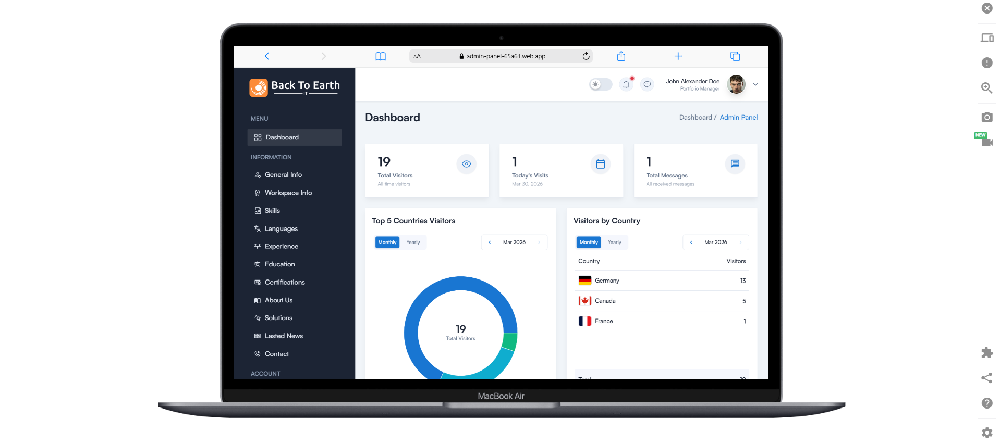
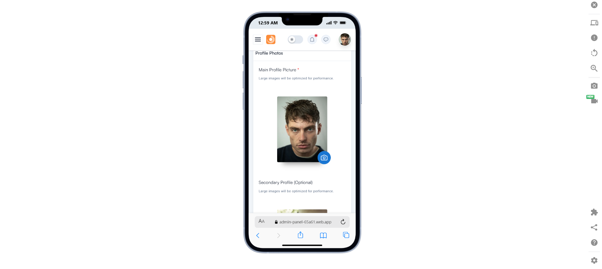
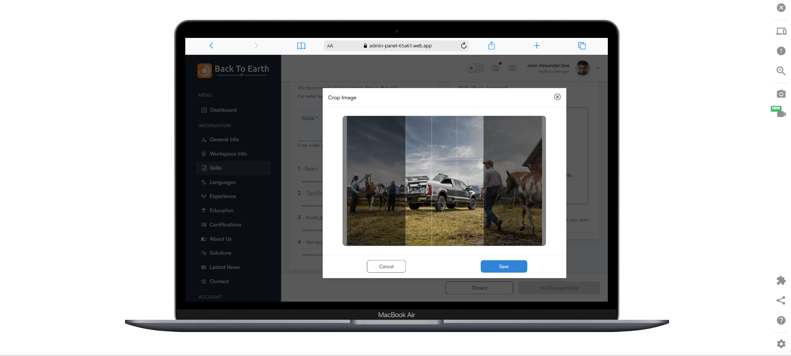
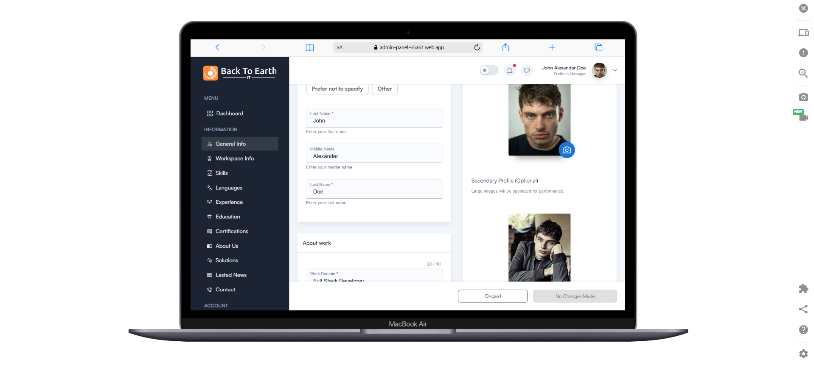
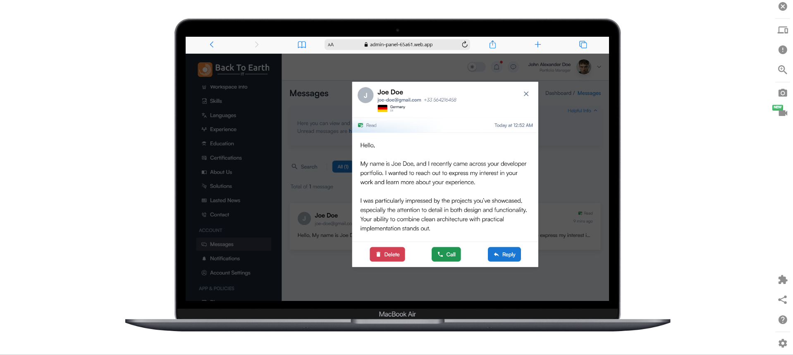
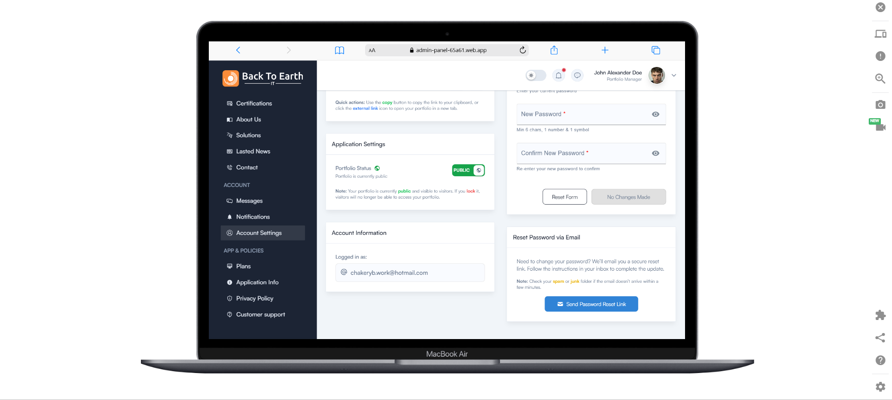
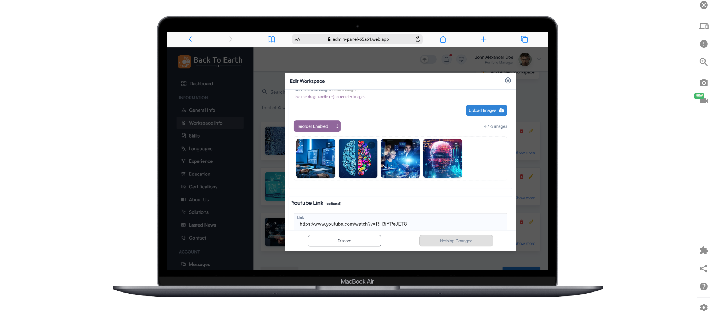

# FlashPortfolio: The Inaugural Project of BackToEarth-IT

> ⚠️ **Private Project Notice**  
This is a private project. The source code is **not publicly available**.  
However, you can view the demo, screenshots, and presentation below.

---

## 📽️ Demo Video
- [Watch Demo on YouTube](https://youtu.be/Yi2ab0d977g)

---

## 📽️ Project Overview  
- [Read Full Project Overview](https://yaakoub-chaker-bteit.web.app/news/flashportfolio-the-inaugural-project-of-backtoearthit-7bELUcIwcFPinaffFQc9)

---

## 🖼️ Screenshots

  

  

  

  

  

  

  

---

## 📌 Project Overview

FlashPortfolio is a customizable portfolio platform built with **React, TypeScript, and Firebase**, designed to help professionals create and manage personalized portfolios with ease.

The platform provides a **complete dashboard system**, authentication, analytics, and dynamic content management, all wrapped in a responsive and modern UI.

---

## ✨ Key Features

- Dashboard Management for portfolio content
- Real-time Notifications System
- Analytics & Visitor Tracking (views, engagement, behavior)
- Full Portfolio Customization Tools
- Responsive UI (desktop / tablet / mobile)
- Dark & Light Mode support
- Secure Google Authentication

---

## 🛠️ Technologies Used

- React
- TypeScript
- Redux
- Firebase (Auth + Hosting)
- ImageKit (CDN & image optimization)
- Google Authentication

---

## 🧠 Notes

This project demonstrates:
- scalable frontend architecture
- dynamic dashboard systems
- authentication and user management
- analytics integration
- modern UI/UX design patterns

---

## 🚧 Status

This project is currently under development and will be available soon.

Stay tuned for updates.

---

## © 2026 BackToEarth-IT
All rights reserved.
